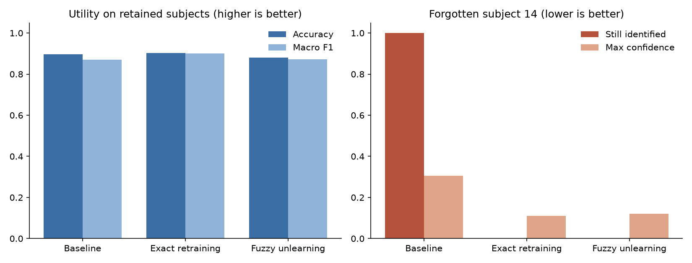
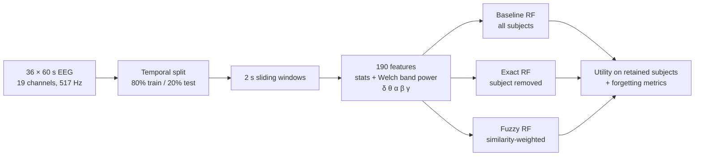

# Machine Unlearning for EEG: Removing a Person from a Trained Model

[](https://github.com/shahrzadtrb-co/eeg-fuzzy-unlearning/actions/workflows/ci.yml)


Under the GDPR, people can ask for their data to be deleted, but a model trained on their data can
still recognise them after the raw records are gone. EEG makes this harder, because brain signals
work as a biometric fingerprint.

This project builds an end-to-end pipeline that trains an EEG subject-identification model, then
**removes one person's influence** from it and measures what that costs. It compares three settings:

| Setting | What it does |
|---|---|
| **Baseline** | Random Forest trained on all 36 subjects |
| **Exact unlearning** | Retrain from scratch without the subject (the gold standard) |
| **Fuzzy unlearning** | Retrain with each remaining sample down-weighted by its similarity to the removed subject |

📄 Full write-up: [`paper/Final_Report_EEG_Unlearning_Torabi.pdf`](paper/Final_Report_EEG_Unlearning_Torabi.pdf)
(Real Life Security seminar, University of Passau, Dec 2025)

## Results

Forgetting subject 14, 36 subjects, 190 features per 2-second window
([`results/reference_run.json`](results/reference_run.json)):

| | Retained accuracy | Retained macro F1 | Forgotten subject still identified | Confidence on forgotten subject | Entropy on forgotten subject |
|---|---:|---:|---:|---:|---:|
| Baseline | 0.897 | 0.871 | **100%** | 0.306 | 2.90 |
| Exact unlearning | **0.903** | **0.900** | **0%** | 0.111 | 3.27 |
| Fuzzy unlearning | 0.880 | 0.872 | **0%** | 0.121 | 3.24 |



**Findings**

- The baseline identifies the subject to be forgotten in every test window. After both unlearning
  methods, the subject is never identified, and the model's confidence on their data drops to near-chance level
  (1/35 ≈ 0.03 is uniform; 0.11–0.12 observed).
- Exact retraining loses **no** utility on the remaining subjects (accuracy 0.897 → 0.903).
- Fuzzy unlearning agrees with exact retraining on **89%** of retained-subject predictions and **100%**
  of forgotten-subject predictions (mean probability gap < 0.011), at a cost of about 2 points of accuracy.
- Accuracy alone can't show forgetting. The model no longer has a class for the removed subject, so
  confidence and entropy are needed to see how much of that person the model still carries.

**Limitations.** With only 5 test windows for the forgotten subject and correlated sliding windows,
one run is weak evidence. `eeg-unlearn sweep` repeats the experiment over every subject and several
seeds to address this (see [Next steps](#next-steps)).

## How it works



- **No leakage between splits:** each recording is split in time before windowing. Test windows don't overlap each other or any training window.
  Unlearned models use a scaler fitted only on retained subjects.
- **Fuzzy weights:** for each retained sample, `d` = mean distance to its 20 nearest forget-subject
  samples; `w = 1 − exp(−d² / 2σ²)` with `σ = median(d)`. Samples that look like the removed person
  count less in training ([`unlearning.py`](src/eeg_unlearning/unlearning.py)).
- **Forgetting metrics:** hit rate (share of windows still classified as the removed subject), mean max
  confidence, predictive entropy, and agreement with exact retraining ([`metrics.py`](src/eeg_unlearning/metrics.py)).

## Quick start

```bash
pip install -e ".[dev]"

# No dataset needed: run the whole pipeline on synthetic EEG (≈5 s)
eeg-unlearn run --synthetic

# With the Kaggle dataset in data/raw/ (see data/README.md)
eeg-unlearn run --config configs/default.yaml            # reproduces the table above
eeg-unlearn run --config configs/default.yaml --subject 3
eeg-unlearn sweep --config configs/default.yaml --seeds 0 1 2 3 4   # every subject × 5 seeds
```

Each run writes `results/run.json` (all metrics, training times and the config used) and
`results/summary.png`. A sweep writes per-run and mean ± std tables as CSV.

**Docker**

```bash
docker build -t eeg-unlearning .
docker run --rm eeg-unlearning run --synthetic
docker run --rm -v "$PWD/data:/app/data" -v "$PWD/results:/app/results" eeg-unlearning
```

**Development:** `make lint test` runs ruff and the pytest suite, which is what CI runs on Python 3.10 and 3.12,
plus a Docker build and an end-to-end smoke run.

## Engineering notes

- **Notebook → package.** The original exploratory notebook
  ([`notebooks/`](notebooks/eeg_fuzzy_unlearning.ipynb)) is refactored into a small library with a CLI,
  a YAML config, and structured JSON/CSV outputs. The notebook stays in the repo as the record of the run in the paper.
- **Tested against the original.** A unit test checks that the vectorised feature extractor gives the
  same values as the notebook's per-channel loop. Another checks that the windowing reproduces the
  paper's sample counts (1,116 train windows, 5 forget-test windows).
- **Faster feature extraction.** The Welch PSD is computed once per window for all 19 channels and
  reused for every band. The notebook computed it 95 times per window (19 channels × 5 bands).
- **Reproducibility.** Seeds are fixed and the full config is saved with every result. The tests also
  found that parallel tree inference (`n_jobs=-1`) makes probabilities vary in the last float digits
  between runs, so they compare those values with a tolerance.

## Repository structure

```text
├── src/eeg_unlearning/
│   ├── config.py        # experiment settings (defaults = paper setup)
│   ├── data.py          # loading, temporal split, windowing, synthetic EEG
│   ├── features.py      # statistical + Welch band-power features
│   ├── unlearning.py    # Random Forest factory, fuzzy weights
│   ├── metrics.py       # utility, forgetting and agreement metrics
│   ├── pipeline.py      # baseline / exact / fuzzy experiment, multi-subject sweep
│   ├── plots.py
│   └── cli.py           # `eeg-unlearn run | sweep`
├── tests/               # pytest suite (runs without the dataset)
├── configs/default.yaml
├── notebooks/           # original exploratory notebook with outputs
├── paper/               # seminar report (PDF)
├── results/reference_run.json
├── figures/
├── Dockerfile, Makefile, pyproject.toml
└── .github/workflows/ci.yml
```

## Next steps

- Run `eeg-unlearn sweep` over all 36 subjects × 5 seeds and report mean ± std, not a single subject.
- Add a membership-inference attack as a stronger forgetting test than confidence and entropy.
- Try approximate methods that avoid a full retrain (e.g. SISA sharding), and compare their cost using the
  `fit_seconds` already recorded per model.

## Author

**Shahrzad Torabi**, M.Sc. Computer Science, University of Passau
